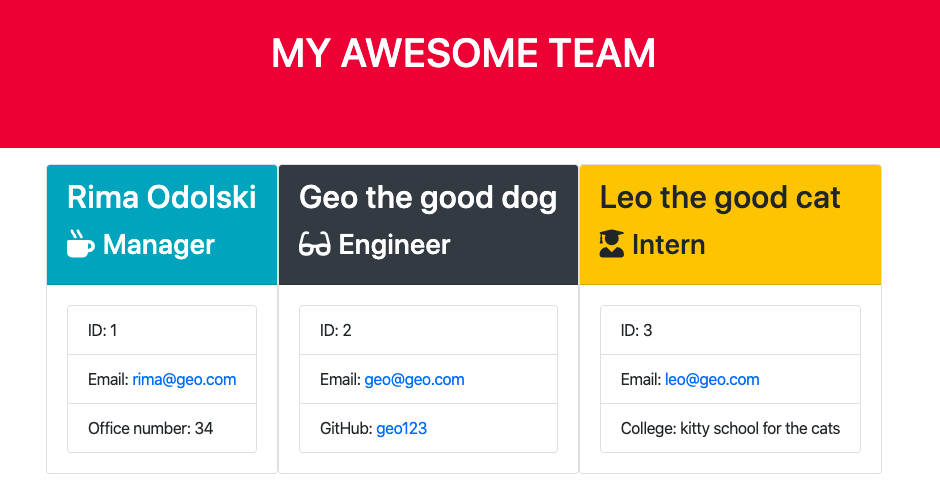

# Employee Summary 

Node CLI that takes in information about employees and generates an HTML webpage that displays summaries for each person. 




### Installation

```
npm i
```

## Built With

* [Javascript](https://www.javascript.com/) 
* [Node](https://nodejs.org/en/)
* [Bootstrap](https://getbootstrap.com/) 
* [npm](https://www.npmjs.com/)


## CLI Snippet 


